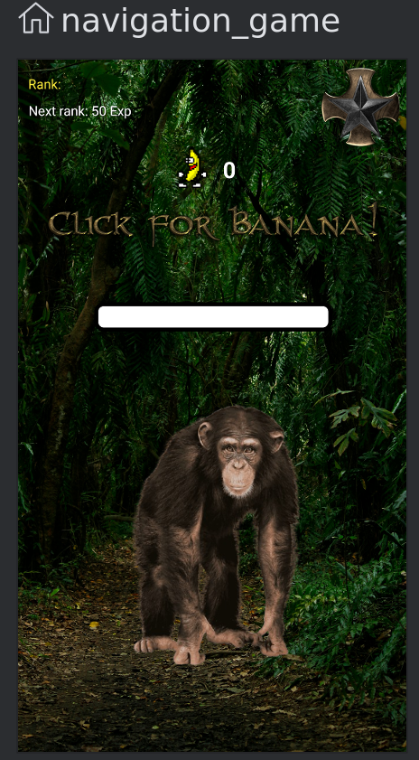
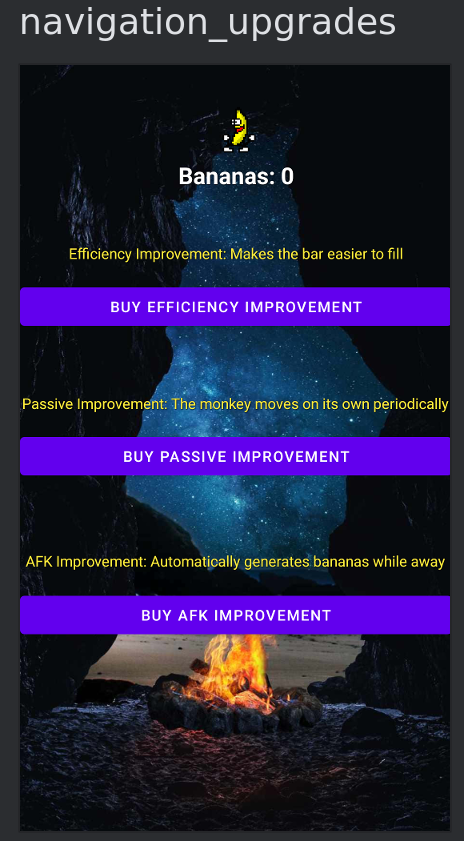
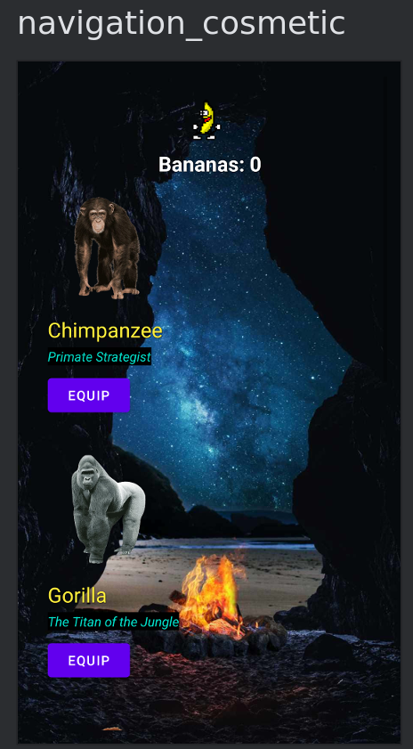

# Diseño 

* Se hará uso de las siguientes características:

    - **ViewModel**: Las variables usadas en más de un fragmento como las bananas (tiendas y juego principal) se guardarán en el ViewModel para un uso mas claro y eficiente

    - **Livedata y Observer**: LiveData es una clase de datos que es sensible a cambios y puede ser observada. Se utilizará para observar cambios en las variables, como el contador de bananas y el de experiencia, para que los fragmentos actualicen su UI automáticamente cuando el valor cambie.
    
    El patrón Observer permite a los fragmentos escuchar y reaccionar a los cambios de estado en el ViewModel sin necesidad de manejar explícitamente las actualizaciones de la UI.

    - **Controlador de Navegación**: El Controlador de Navegación permite gestionar de manera más eficiente la navegación entre los diferentes fragmentos de la aplicación, como la transición entre la tienda, el juego principal

    - **SharedPreferences**: SharedPreferences se utilizará para guardar información persistente entre sesiones, como configuraciones del usuario, estadísticas de juego, o el progreso en la aplicación (por ejemplo, el número de bananas acumuladas).

## Navegación 

### Fragmento del juego principal

- Comparte la cantidad de bananas a ambas tiendas

### Fragmento de las mejoras

- Comparte las mejoras com

### Fragmento de los cosméticos

## Índice

1. [Estudio preliminar](1.descripcion.md)
2. [Análisis](2.analisis.md)
3. [Diseño](3.disenho.md)
   - [Referencias](referencias.md)